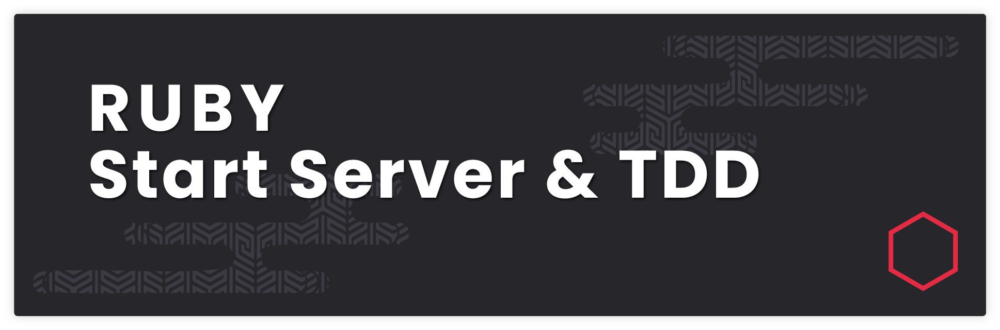
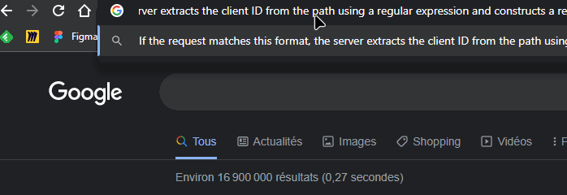
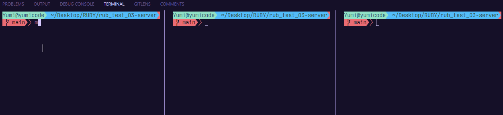

# RUBY start server & TDD



## Introduction

Ruby is a general-purpose language used to create web applications, as it has development frameworks already installed.

Ruby provides libraries that enable developers to work with various networking protocols at the application level, such as FTP, HTTP, and TCP. These libraries offer a high-level interface, making it easier for developers to access and utilize these protocols in their applications.

This repository contains a simple server implementation written in Ruby. The purpose of this repository is to provide a starting point for developers who want to create a simple web server using pure Ruby.

The server is designed to handle basic HTTP requests, including GET, POST, and PUT requests. It supports static file serving and can be easily extended to include dynamic content generation using Ruby-based templates or other web frameworks.

Hope it can help :)

## Summary

- [Tools and version](#tools-and-versions)
- [Folder structure](#folder-structure)
- [Requirements](#requirements)
- [Makefile usage](#makefile-usage)
- [Project : Build a server](#project)
- [Sources](#sources)

## Tools and versions

- OS

  - Kali Linux OS - Ruby v3.1.2
  - Windows OS - Ruby v3.2.2

- IDE
  - VSCodium v1.77.1

## Folder structure

```sh
├── Makefile
├── README.md
└── src
|  ├── server.rb
|  ├── server_2.rb
|  └── test_server.rb
```

## Requirements

Ruby installed on your machine.

## Makefile Usage

Considering you already have Ruby and Make on your host machine, you can use make to read any file inside this repo:

Launch server 1:

```sh
make run_server_1
```

Launch server 2:

```sh
make run_server_2
```

Launch test

```sh
make run_test
```

## Project

### Build a server

---

First web server : server.rb

- Require the 'socket' library, which provides low-level networking functionality to Ruby programs.

```rb
require "socket"
```

- Set the port number that the server will listen on:

```rb
port = ENV.fetch("PORT", 3008).to_i
```

This line uses the fetch method from the ENV hash to get the value of the PORT environment variable. If the environment variable is not set, it defaults to port 3008.

- Create a new `TCPServer` instance:

```rb
server = TCPServer.new port
```

- Message to the console: This line prints a message to the console indicating that the server has started and the URL that it is listening on.

```rb
puts "Starting server http://localhost:#{port}"
```

- Listen for incoming connections and send response back:

This section starts a loop that listens for incoming connections and sends a response back to the client if the request message matches a certain format.

```rb
loop do
  client = server.accept
  request = client.gets

  if result = request.match(/^Hello from client (.*?)$/)
    client_id = result[1]
    response = "Hey, #{client_id}!"
    client.puts(response)
  end

  client.close
end
```

- Deep dive:
  - `server.accept` waits for a client to connect to the server and returns a new TCPSocket object that represents the connection.
  - `client.gets` reads a line of text from the client's request message.
  - `request.match(/^Hello from client (.\*?)$/)`: This checks if the request message from the client matches a specific format, in this case, a string that starts with "Hello from client " and has a client ID following it. The client ID is captured using a regular expression.
  - If the request matches the format, the client ID is extracted from the request message, and a response message is constructed containing the client ID.
  - The response message is then sent back to the client using the client.puts method.
  - Finally, the client.close method is called to close the connection.
    This loop will run indefinitely, listening for incoming connections and responding to them based on the content of the client's request message.

---

Second web server

For this example, we will idsplay the result in the browser.

The server reads the first line of the client's HTTP request, which contains the HTTP verb (GET, POST, etc.) and the path requested by the client.

```rb
  client = socket.accept
  first_line = client.gets
  verb, path, _ = first_line.split
```

Check if the HTTP verb is GET and the requested path matches a specific format. In this case, the server is looking for a request that matches the pattern /customers/{id}, where {id} is a parameter containing the client ID.

```rb
if verb == "GET"
  if result = path.match(/^\/customers\/(.*?)$/)
    client_id = result[1]
    response = "HTTP/1.1 200\r\n\r\n Hey, #{client_id}!"
    client.puts(response)
  end
end
```

If the request matches this format, the server extracts the client ID from the path using a regular expression and constructs a response message containing the client ID. The response message is sent back to the client using the client.puts method.

Result:



---

Test-Driven Development

"First, make it fail, then code"

TDD stands for Test-Driven Development. It is a software development methodology in which tests are written before the actual code is written. The idea behind TDD is to ensure that the code being developed is correct and meets the requirements by continuously testing the code throughout the development process.

In TDD, the developer first writes a test for a specific feature, ensuring that the test fails because the feature does not exist yet. The developer then writes the minimum amount of code needed to make the test pass. After the test passes, the developer refactors the code to improve its design and clarity. This process is then repeated for the next feature or requirement.

In this example, the test is created to run as the client. We create a TCP client using test/unit : the test will be the client

```rb
require "socket"
# consider the test will be the client to see results
require "test/unit"

class ServerTest < Test::Unit::TestCase

# First test on First server
def test_tcp_request_response
    server = TCPSocket.open("localhost", 3008)

    # send a request message to the server
    request = "Hello from client A"
    server.puts(request)

    # read the response message from the server
    response = server.gets
    assert_equal "Hey, A!\n", response
    puts response

    # close the socket connection to the server
    server.close
  end

# First test on second server
  def test_http_customer_42
    server = TCPSocket.open("localhost", 80)

    request = "" "GET /customers/42 HTTP/1.1\r\nAccept: */*\r\n\r\n" ""

    server.puts(request)

    response = ""

    while line = server.gets
      response += line
    end

    expected = "" "HTTP/1.1 200\r\n\r\nHey, 42!\n" ""

    assert_equal expected, response
    puts response

    server.close
  end
end
```

Result:



---

## Sources

- [Build simple server](https://www.educative.io/answers/how-to-build-a-simple-server-in-ruby)
- [Basics tcp server](https://dev.to/leandronsp/web-basics-a-tcp-server-in-ruby-947)
